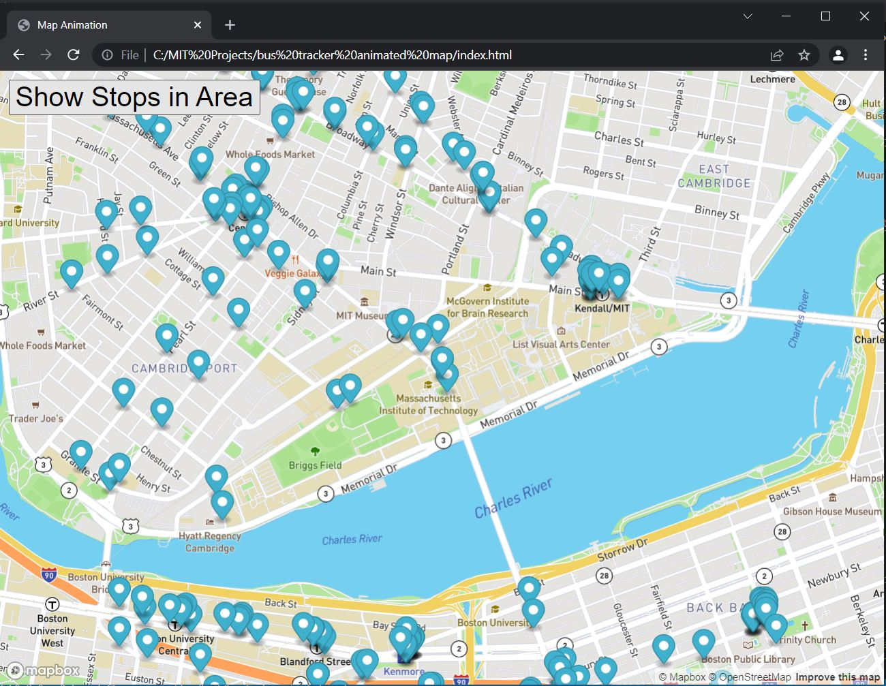

# Real-Time-Bus-Tracker

While in the city of Boston you can see all bus stops in a mile radius when given starting longitude and latitude coordinates
Originally the program provided you all of the bus stops between one point and another. This program now will look at a radius around your current location and tell you where all of the bus stops are. 
A request is made to get the longitude and latitudes of the bus stops in a mile radius and then markers are created on the map.

# Installation
To run this program
- you will need a Mapbox token to be able use the Mapbox library.
- download the JavaScript, HTML and CSS files from the repository
- provide a starting Longitude and Latitude set of coordinates in the city of Boston

# Road Map
A future improvement could be to show in real time where the bus is in relation to the bus stop.

# License Information

Permission is hereby granted, free of charge, to any person obtaining a copy of this software and associated documentation files (the "Software"), to deal in the Software without restriction, including without limitation the rights to use, copy, modify, merge, publish, distribute, sublicense, and/or sell copies of the Software, and to permit persons to whom the Software is furnished to do so, subject to the following conditions:

The above copyright notice and this permission notice shall be included in all copies or substantial portions of the Software.

THE SOFTWARE IS PROVIDED "AS IS", WITHOUT WARRANTY OF ANY KIND, EXPRESS OR IMPLIED, INCLUDING BUT NOT LIMITED TO THE WARRANTIES OF MERCHANTABILITY, FITNESS FOR A PARTICULAR PURPOSE AND NONINFRINGEMENT. IN NO EVENT SHALL THE AUTHORS OR COPYRIGHT HOLDERS BE LIABLE FOR ANY CLAIM, DAMAGES OR OTHER LIABILITY, WHETHER IN AN ACTION OF CONTRACT, TORT OR OTHERWISE, ARISING FROM, OUT OF OR IN CONNECTION WITH THE SOFTWARE OR THE USE OR OTHER DEALINGS IN THE SOFTWARE.
